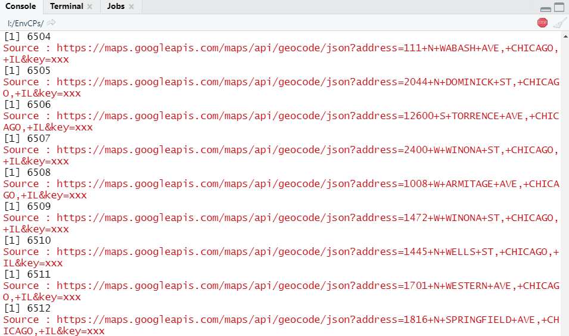

# Data and Data Structure

## Data Source

I got this data form my senior in my research group. The name of the data is "CDPH_Environmental_Complaints", which indicates the data is form [California Department of Public Health(CDPH)](https://www.cdph.ca.gov/), and the content is about the environmental complaints in Chicago.

You can click [here](https://cxdong66.github.io/FinalProject/data/CDPH_Environmental_Complaints.csv) to download this data.

***

## Data Structure

Firstly, we need to load the libraries.
```{r}
library(tidyr)
library(dplyr)
```

Then load the raw data and make it as tibble class:
```{r}
RawData <- read.csv("I://FinalProject/data/CDPH_Environmental_Complaints.csv",header = T)
RawData_tbl <- as_tibble(RawData)
```

Look into the structure of the data:
```{r}
colnames(RawData_tbl)
```
```{r}
head(RawData_tbl)
```
```{r}
tail(RawData_tbl)
```

Get the categories of the complaints.
```{r}
CATOfCPs_0 <- unique(RawData_tbl$COMPLAINT.TYPE)
```

```{r}
sort(CATOfCPs_0)
```
After the sort, we find out every category has a capitalized name and a lower case name instead of the "Other".

***

## Summary

+ 1 **Data Structure**
  - 1.1 The more useful contents are: "COMPLAINT.ID, COMPLAINT.TYPE, ADDRESS, COMPLAINT.DATE, COMPLAINT.DETAIL, LATITUDE, LONGITUDE, LOCATION" .
  - 1.2 The most useful content to me is the "COMPLAINT.TYPE".
+ 2 **Problems of Data**
  - 2.1 There are some categories of "COMPLAINT.TYPE" have **different names**, but the meanings are the same.
  - 2.2 Some complaints lost the **coordinates**, but the **addresses** are accurate.

***


# Data Wrangling


## Correct the categories of CPs.TYPE

Rename all categories to upper case.
```{r}
RawData_tbl$COMPLAINT.TYPE <- toupper(RawData_tbl$COMPLAINT.TYPE)
CATOfCPs_1<-unique(RawData_tbl$COMPLAINT.TYPE)
sort(CATOfCPs_1)
```


***


## Change the class of "COMPLAINT.DATE" to date

Check the date of the data
```{r}
typeof(RawData_tbl$COMPLAINT.DATE)
```
Change the character type to Date type
```{r}
RawData_tbl$COMPLAINT.DATE <- as.Date(RawData_tbl$COMPLAINT.DATE,"%m/%d/%Y")
```
Check the date range
```{r}
range(RawData_tbl$COMPLAINT.DATE,na.rm = T)
```


***


## Address to Coordinate
Due to recording or no reason, the coordinates of many complaints in raw data are missing, so we need a path to get the coordinates by addresses.
Here I use the "geocode" function in package "ggmap"

Add the libraries 
```{r}
library(ggmap)
library(httr)#For proxy setting
```

Data selection 
```{r}
A2C_DATA_tbl <- RawData_tbl
A2C_DATA_tbl_1 <- A2C_DATA_tbl %>% 
  select(COMPLAINT.ID,COMPLAINT.TYPE,ADDRESS,COMPLAINT.DATE,COMPLAINT.DETAIL,LATITUDE,LONGITUDE,LOCATION)
```

Since the Google service is blocked, which is needed using the "geocode", so we need to set the proxy in RStudio first.
```{r}
set_config(
  use_proxy(url="127.0.0.1", 
            port=1080, username = NULL,password = NULL,)
  #I'm using Shadowsocks as my VPN client, to anyone confused about how to set the value of each arguments, you need to find the information in your VPN client.
  
)
```

Then we need to register our Google Map API service by the "key"  

> Click [here](https://github.com/dkahle/ggmap/) to see how to get the Google API and the key.(An international credit card is needed)

```{r}
ggmap::register_google(key = "xxx")
#xxx means your key 

```
<font size="2.5" color="red">I highly recommend you that **do not save your key in your script**, otherwise you may get a large credit card bill if someone else use your key!!!</font>

Then we do the translation one by one with the NA check
```{r,eval=FALSE}
for(i in 1:nrow(A2C_DATA_tbl_1)){
  print(i)
  if(is.na(A2C_DATA_tbl_1$LATITUDE[i])){
    result <- geocode(A2C_DATA_tbl_1$ADDRESS[i], output = "latlona", source = "google")
    A2C_DATA_tbl_1$LONGITUDE[i] <- as.numeric(result[1])
    A2C_DATA_tbl_1$LATITUDE[i] <- as.numeric(result[2])
    #Check if the raw data already have the coordinates, if not:assgin it by result, else: keep unchanged.
    #A2C_DATA_tbl_1$geoAddress[i] <- as.character(result[3])
  }else{
    next
  }
}
```
Here is how it looks like when running the script(49890 in total)


Save it as a csv file named ["A2C_DATA_tbl_1.csv"](https://cxdong66.github.io/FinalProject/data/A2C_DATA_tbl_1.csv)
```{r,eval=FALSE}
write.csv(A2C_DATA_tbl_1, "A2C_DATA_tbl_1.csv")
```


