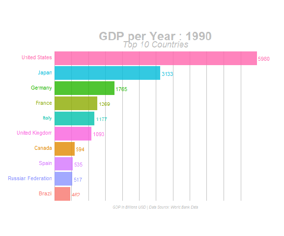

Bar Chart Race is an useful way to display time series in bar chart format via animation. Here is an example of Bar Chart Race.


Learn from the [R-bloggers](https://www.r-bloggers.com/2020/01/how-to-create-bar-race-animation-charts-in-r/) website.

# Data Wrangling
What we need to do is summarize each single complaint information by complaint type and year.

Load the libraries
```{r}
library(tidyr)
library(dplyr)
library(ggplot2)
library(gganimate)
library(gifski)
```

Read the data and do the summarize
```{r}
BarData <- read.csv("I://FinalProject/data/A2C_DATA_tbl_1.csv",header = T)
BarData_tbl <- as_tibble(BarData)
BarData_tbl <- BarData_tbl %>% 
  select(COMPLAINT.ID,COMPLAINT.TYPE,COMPLAINT.DATE)
#Change the class of DATE
BarData_tbl$COMPLAINT.DATE <- as.Date(BarData_tbl$COMPLAINT.DATE)
#Do the summarize
BarData_tbl_1 <- BarData_tbl %>% 
  mutate(YEAR = as.integer(format(COMPLAINT.DATE,"%Y"))) %>% 
  filter(YEAR <= 2019) %>% #Data in 2020 is not comprehensive
  group_by(YEAR,COMPLAINT.TYPE) %>% 
  summarise(COUNT = n())

```

Check the result 
```{r}
BarData_tbl_1
```

Rank the Data within top 10
```{r,eval=FALSE}
Bar_Formatted <- BarData_tbl_1 %>% 
  group_by(YEAR) %>% 
  mutate(COUNT_lbl = scales::number(COUNT, acc = 1)) %>% #Force the COUNT to be integer
  mutate(RANK = as.integer(rank(-COUNT,na.last = NA))) %>%
  group_by(COMPLAINT.TYPE) %>% 
  filter(RANK <= 10) %>%
  ungroup()
```


# Animation

```{r,eval=FALSE}
anim <- ggplot(Bar_Formatted, aes(RANK, group = COMPLAINT.TYPE, 
                                  fill = as.factor(COMPLAINT.TYPE), color = as.factor(COMPLAINT.TYPE))) +
  geom_tile(aes(y = COUNT/2,
                height = COUNT,
                width = 0.9), alpha = 0.8, color = NA) +
  geom_text(aes(y = 0, label = paste(COMPLAINT.TYPE, " ")), vjust = 0.2, hjust = 1, size = 5) +
  geom_text(aes(y=COUNT,label = COUNT_lbl, hjust=0),size = 8) +
  coord_flip(clip = "off", expand = FALSE) +
  scale_y_continuous(labels =scales::comma) +
  scale_x_reverse() +
  guides(color = FALSE, fill = FALSE) +
  theme(axis.line=element_blank(),
        axis.text.x=element_blank(),
        axis.text.y=element_blank(),
        axis.ticks=element_blank(),
        axis.title.x=element_blank(),
        axis.title.y=element_blank(),
        legend.position="none",
        panel.background=element_blank(),
        panel.border=element_blank(),
        panel.grid.major=element_blank(),
        panel.grid.minor=element_blank(),
        panel.grid.major.x = element_line( size=.1, color="grey" ),
        panel.grid.minor.x = element_line( size=.1, color="grey" ),
        plot.title=element_text(size=30, hjust=0.5, face="bold", colour="grey", vjust=-1,line = 2),
        plot.subtitle=element_text(size=18, hjust=1, face="italic", color="grey"),
        plot.caption =element_text(size=12, hjust=0.5, face="italic", color="grey"),
        plot.background=element_blank(),
        plot.margin = margin(1,3, 1, 13, "cm")) +
  transition_states(YEAR, transition_length = 4, state_length = 1, wrap = FALSE) +
  view_follow(fixed_x = TRUE)  +
  labs(title = 'Envrionmental Complaints in Chicago : {closest_state}',  
       subtitle  =  "Top 10 categories",
       caption  = "Data Source: California Department of Public Health") 

```

Save it as gif
```{r,eval=FALSE}
animate(anim, 600, fps = 30,  width = 1920, height = 1080, 
        renderer = gifski_renderer("gganim4.gif"), end_pause = 15, start_pause =  15)

```
Here is the result!


**We can find that the Noise and Air pollution are the consistently higher problems.**